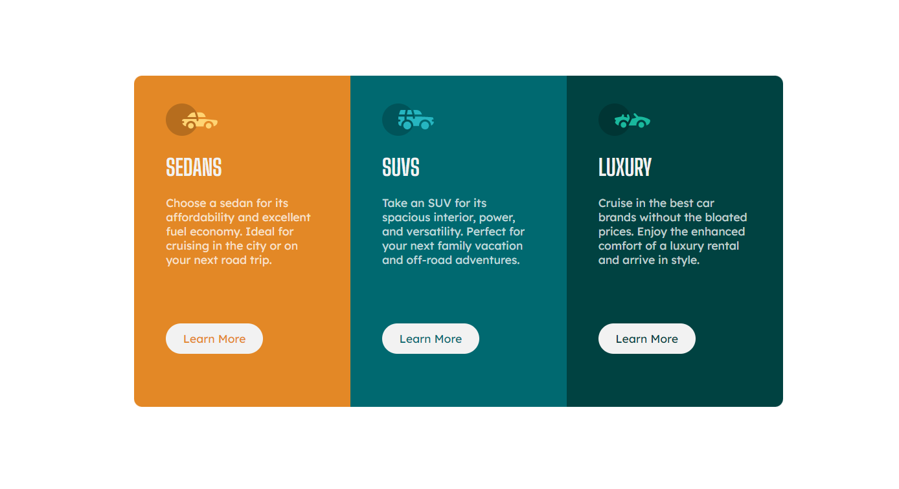

# Frontend Mentor - 3-column preview card component solution

This is a solution to the [3-column preview card component challenge on Frontend Mentor](https://www.frontendmentor.io/challenges/3column-preview-card-component-pH92eAR2-).

## Table of contents

- [Overview](#overview)
  - [The challenge](#the-challenge)
  - [Screenshot](#screenshot)
  - [Links](#links)
- [My process](#my-process)
  - [Built with](#built-with)
  - [What I learned](#what-i-learned)
  - [Continued development](#continued-development)
  - [Useful resources](#useful-resources)
- [Author](#author)
- [Acknowledgments](#acknowledgments)

## Overview

I made a project **3-column preview card component** using *Grid*. This is responsive site. I created 2 CSS styles files. One is (desktop_design.css) for desktop design and second is (mobile_design.css) for mobile view. Below mention are all the styles and refrence and my process on how to do this and what difficulties I were facing.

### The challenge

Users should be able to:
- Make this project using grid
- View the optimal layout depending on their device's screen size
- See hover states for interactive elements

### Screenshot


Above screenshot is of mobile view. That shows how it was design.


Above screenshot is of design view. That shows how it was design.

### Links

- Solution URL: [Add solution URL here](https://your-solution-url.com)
- Live Site URL: [Add live site URL here](https://your-live-site-url.com)

## My process

Processes are mentioned here to make this site:
1. Created ID in html file in body section for **3-column preview card component**.
2. I created grid of 3 boxes.
3. In each box, I added icon, paragraph and button with common class, inserted background color and text color correspondingly.
4. I used hover in each box for active.
5. I used media queries for responsive website.

### Built with

- Semantic HTML5 markup
- CSS custom properties
- CSS Grid
- Media Queries

### What I learned

```css
.proud-of-this-css {
  .grid {
    display: grid;
    grid-template-columns: 267px 267px 267px;
    grid-template-rows: 410px;
    justify-content: center;
    margin: 150px;
  }
}
```

### Continued development

I'll continue this journey because lot of exploration is out there. This is my 3rd project using HTML, CSS but something is missing and that is JAVASCRIPT. I want to have a good practice in that also.

### Useful resources

- [Lexend Deca](https://fonts.google.com/specimen/Lexend+Deca) - This helped me for font style. I really liked this pattern and will use it going forward.
- [Big Shoulders Display](https://fonts.google.com/specimen/Big+Shoulders+Display) - This helped me for font style. I really liked this pattern and will use it going forward.

## Author

- Frontend Mentor - [@@codekesh](https://www.frontendmentor.io/profile/codekesh)
- Twitter - [@tulsyan_keshav](https://twitter.com/tulsyan_keshav)

## Acknowledgments
I am solo player for this project. I am beginner so for learning purpose, I tried my own and I think I give my best for making this website.